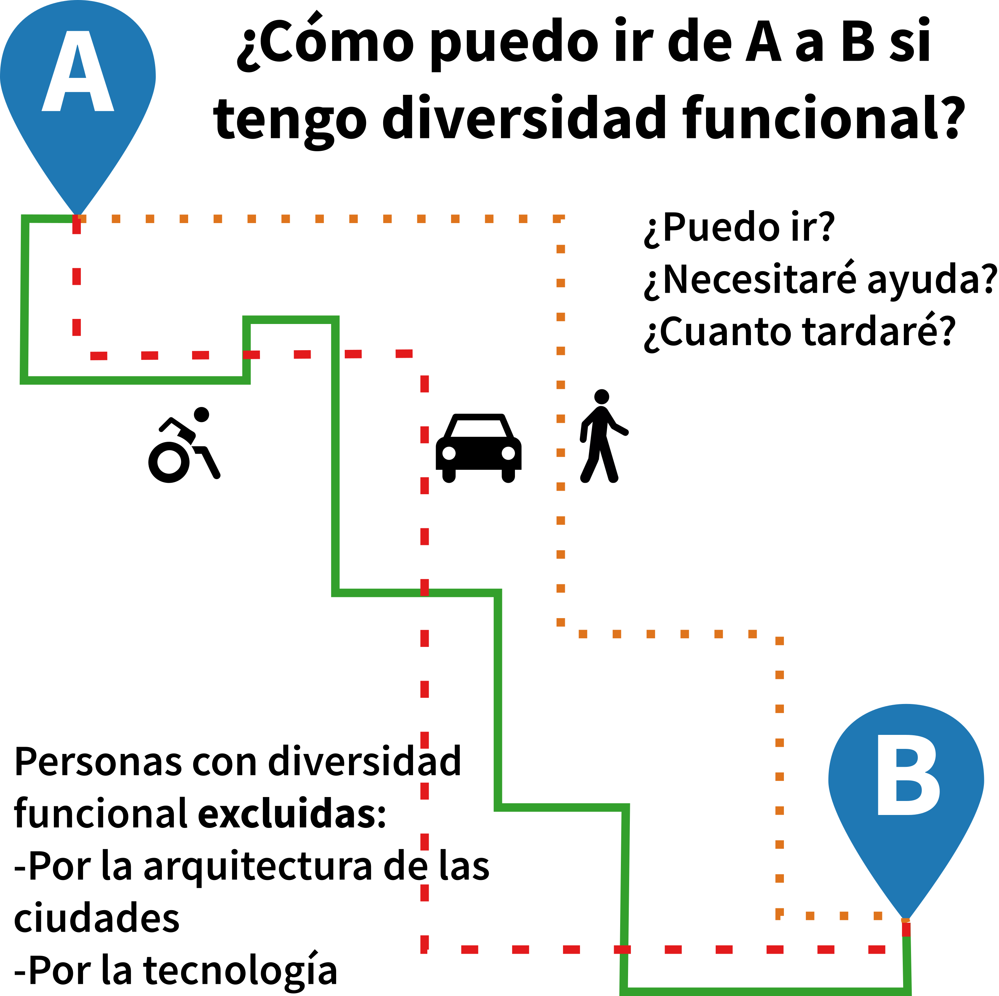

+++
title = "Accessible Zaragoza"
description = ""
outputs = ["Reveal"]

[reveal_hugo]
# theme = "white"
custom_theme = "usj.scss"
custom_theme_compile = true
plugins = ["plugin/gallery/gallery.plugin.js"]

# custom_theme = "css/usj.css"
# custom_theme_compile = false

# [logo]
# src = "/img/usj/logo-usj-negro.png"
# alt = "Universidad San Jorge Logo"

[reveal_hugo.templates.bg-dark]
class = "bg-dark"
background = "#000"
data-background-opacity = "0.3"

[reveal_hugo.templates.bibliographical-ref]
class = "bibliographical-ref"

[reveal_hugo.templates.bg-caption]
class = "bg-caption"

+++



Past, present and future of

## Accessible Zaragoza study case

Improving handicapped people's autonomy through collaborative mapping

Carlos Cámara* | Miguel Sevilla**  | Javier Corzán*  | Javier Claver* | Ana Ruiz*

*: Universidad San Jorge, **: Mapeado Colaborativo, Universidad de Zaragoza, IPE-CSIC.

{}
You found the speaker notes!
{}

---

{}

## Background (2016)

* Since 2010: **Private Sponsorship** by Bantierra-Fundación Adecco, aimed to promote action research projects regarding disabilities at Universidad San Jorge.
  - Replacement: Ángel Comeras (2010-2014) -> Carlos Cámara (2016)

{}
Let me start with a confession/disclaimer: I am a nerd. A nerd who loves collaboration, technology, maps, cities and, more specifically their social dimension and how they relate to each other. This is important to understand everything else.

Another important issue is that, on that in 2016, at AOS we had just finished our main research project: Zaragoza's Social Risk Map
Being said that in 2015, I replaced Angel Comeras as main researcher at the Bantierra-Fundación Sponsorship aimed to...

{}

---

### New people, new approach:

1. Extending the research to **urban scale** (Buildings -> cities)
2. Focusing on Service-Learning dimension
2. Connecting (unconsciously) with our prior research on (social) **exclusion and urban morphology**.

{}

---



## The problem(s)

People with disabilities cannot be fully autonomous when moving within a city (especially in an unknown city).

Two types of exclusion:

* **Physical**: urban design
* **Technological**: (lack of) specialized apps/services

Photo: Igor Rodrigues

---



## Our Goal

<!--  -->

The creation of a **pilot** to overcome those 2 problems.

* Map capable of:
  - Assessing Zaragoza in terms of accessibility
  - Providing routing calculations for disabled people in order to improve their autonomy
- Test a protocol/methodology

---

{}
## Our Principle: Open and collaborative project

---

### Political decision:
  - Results should be used and shared by anyone if they are to be of any use
  - Citizenship has to be part of it

---

### Pragmatic decision:
  - Overcome our own limitations (staff, infrastructure)
  - Reduce setup time

{}

---



## OpenStreetMap

AKA "The wikipedia of the maps"

* **Crowdsorced approach** (data gathering, standardization)
* **Sharing data** (legally + technically): return to society

{}
More specifically, this principle led us to use OSM.
{}

---



## Teaming up with others

* [Mapeado Colaborativo](https://mapcolabora.org) (Zaragoza Activa)
* Association/Activism:
  - Discapacitados Sin Fronteras
  - Mundo Crip
  - Ganchillo Social
- Administration:
  - Civic Centers

Mapping party organized by Mapeado Colaborativo and Discapacitados Sin Fronteras Aragón.

