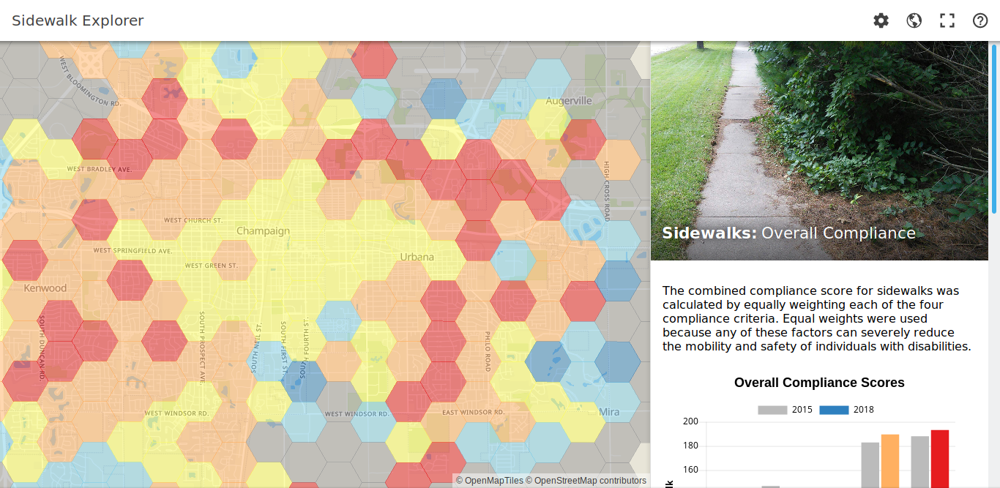
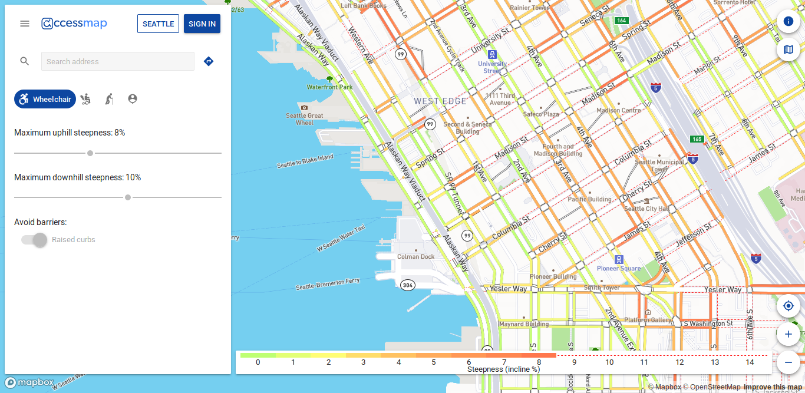
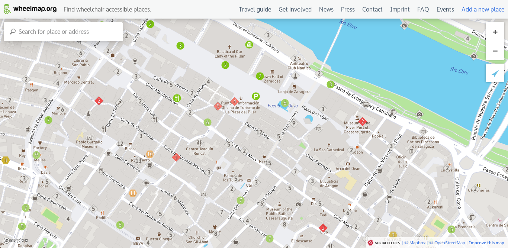
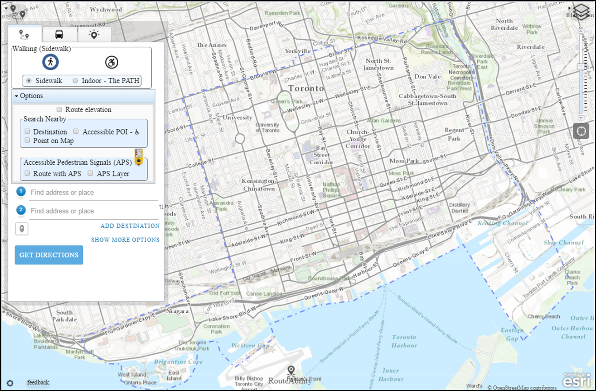
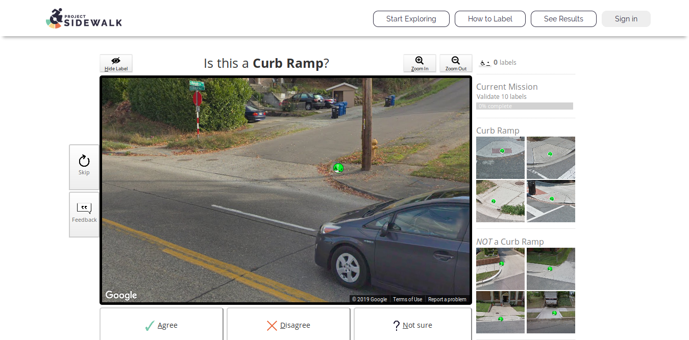
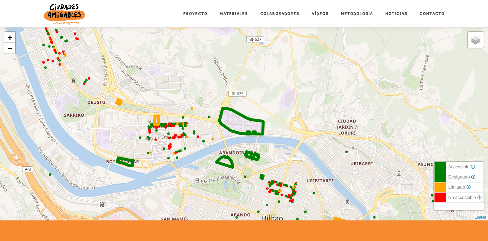
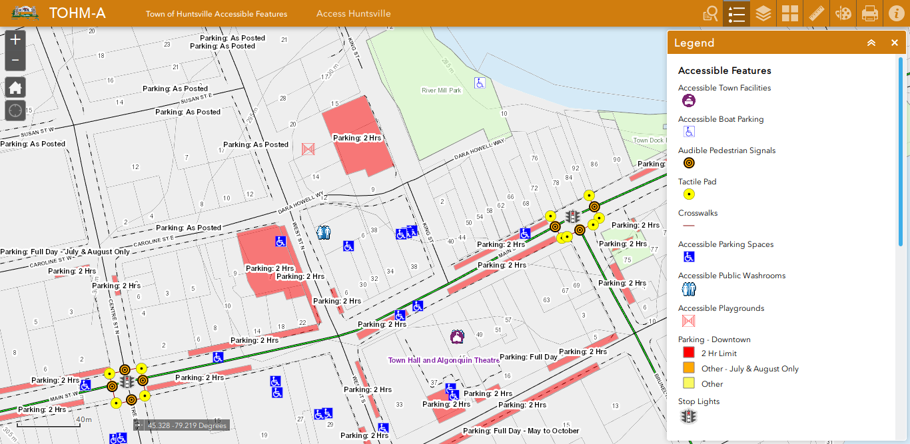

+++
weight = 20
+++

## What are we working now (2019-...)

Let's talk about the present (and the future)

---



## State of the art

* Several types:
  - **Scale**: Buildings / Streets
  - **Aim:** Visualization / Validation / Routing
  - **Code:** OpenSource / Closed
  - **Data:** Crowdsorced / Imported / Private
* Purpose: reflect on our own work
  - Whishlist for Zaccesible

<ul class="gallery" data-iterations="0" data-interval="2" data-mode="full-screen">
  <li></li>
  <li></li>
  <li></li>
  <li></li>
  <li></li>
  <li></li>
  <li></li>

</ul>

{}

Conclusions:

* Some maps use a **coefficient to measure the grade of accessibility** depending of the slope, the pavement, the crossing… That enrich the map and make it more usable.
* Some maps show several levels of lecture depending on the user. (researcher, disable people…)
* The north-american maps are more completed than the rest because public administration is obligated to publish the data they have of the cities
* Some projects use citizens participation using gamification tools to get data.
* Each project has its own approach to the topic. It has no sense trying to get all about urban accessibility in a map.

Zaccesible wishlist

* Lines should show sidewalks instead of roads.
* Crossings should be lines instead of points.
* Maps should be readable by disable people.
* There is no immediate information updated.
* It could be interesting show the main public buildings…etc
* Aspiration
  - Create a tool to evaluate urban accessibility in Spain/Aragón/Zaragoza. (Corzán. Point 2)
    - That tool will get a Coefficient of urban accessibility.
    -This coefficient of urban accessibility will based on the applied regulation.
  * Create a map readable by disabled people. (Claver)
  * Improve the system of getting and updating information. (Carlos and Claver)

{}

---



## Summary/comparison of regulation

Infographic summarising situations described in accessibility regulations, by Javier Corzán.

---

{}



## Custom base maps

Protanopia and Deuteranopia

{}

* Combination red-yellow-green soft-blue allows them an adequate and understandable visualization.
* Font that improves readibility for the users with visual disability.  -> typeface designed by American Printing House for the Blind, inc.

{}

---



Tritanopia

{}

* black and white degraded depending on the use, making it easier for the user to read.
* Font: OpenDyslexic

{}

{}

---



## Assessing Zaragoza's neighbours

---



## Networking

Things are better when done together!

---



## The future...

---

## Keep on with good work

* Mapping parties
  - Awareness raising
  - Empowering
  - Data gathering
* Service Learning Activities
  - Improving students curricula (technical + social skills)
* Improve data gathering*:
  - Easier methodology/toolset

<small>*Under the lead/expertise of [Mapeado Colaborativo](https://mapcolabora.org)</small>

---

{}

## New approach to the project

Some other things need to be rethinked

---

<!--  -->


## Create a modular approach

- Vast and complex field
  - No need for everyone to do everyhing -> stand on the shoulders of giants
- Encourage collaboration
  - Autonomous groups working in what they are best at

Wikihouse's scheme: an example of modular (and open) construction system.

---

## New Focus to the theme

* Pivot from _Service-Learning_ programmes to _Research programmes_.
* Enhance _citizen science_'s dimension.
* Link the project with prior research on (social) **exclusion and urban morphology**
  1. Right to the city (Lefebvre, 168; Harvey 2008)
  2. Spatial Justice (Soja, 2010)

{}
Focus on the imbrications between urban design/form and exclusion/inclusion -> our real expertise.

{}

{}

---
{}



---



* To you, for your attention
* [AOS Research Group](http://aos.usj.es) and Universidad San Jorge, for their support and financing.
* [Zaccesible research staff](https://zaccesible.usj.es/about/#miembros-del-proyecto) (present, and former)
* [Mapeado Colaborativo](https://mapcolabora.org), for their valuable collaboration from the very beginning.
* All volunteers and associations, for their help in data collection (DSFA, Ganchillo Social, Mundo Crip, AAVV...).
* Colegio de Arquitectos de Aragón, for being such great hosts.

{}
[Zaccesible research staff](https://zaccesible.usj.es/about/#miembros-del-proyecto):

* Carlos Cámara-Menoyo (USJ)
* Ana Ruiz-Varona (USJ)
* Miguel Sevilla-Callejo (UNIZAR, IPE-CSIC, Mapeado Colaborativo)
* Javier Corzán (Research Assistant)
* Javier Claver (Intern)

#### Previous staff:

* César Canalís (Research Assistant)
* Lourdes Pérez (Intern)

{}

{}

<!-- ---

<iframe src='https://cdn.knightlab.com/libs/timeline3/latest/embed/index.html?source=1FEzze9hjnmD4oHz5vfp3mpTFQi7ek9TwzJPMtx1lXtU&font=Default&lang=en&hash_bookmark=true&initial_zoom=2&start_at_slide=3&height=650' width='100%' height='650' webkitallowfullscreen mozallowfullscreen allowfullscreen frameborder='0'></iframe> -->
