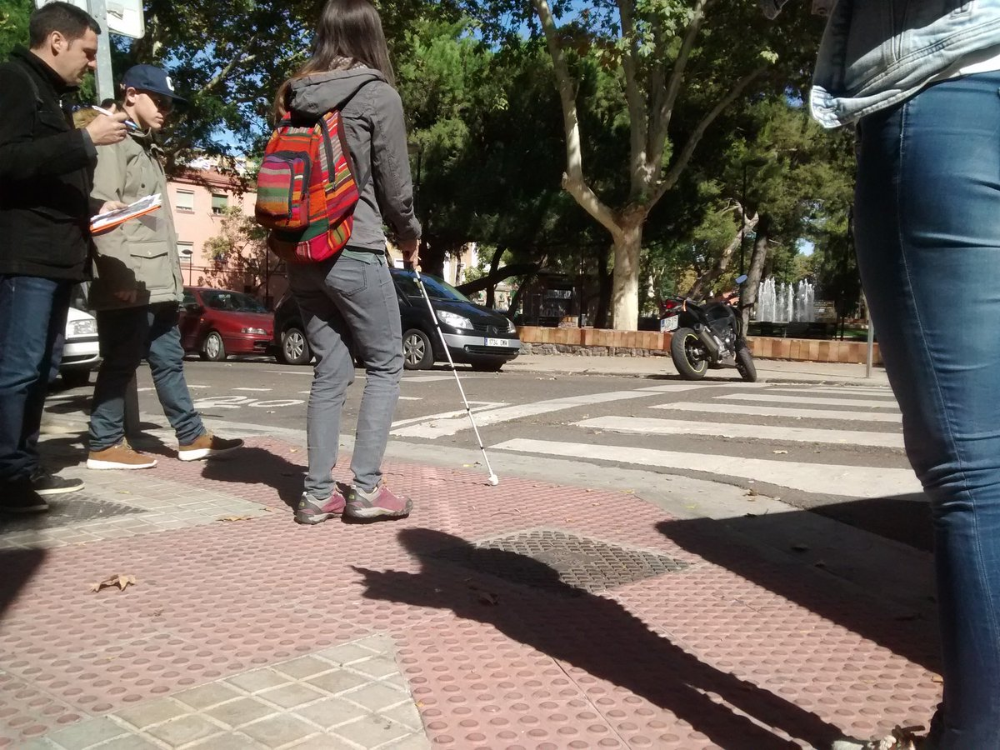
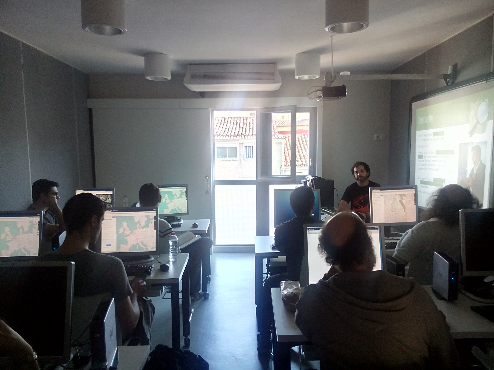
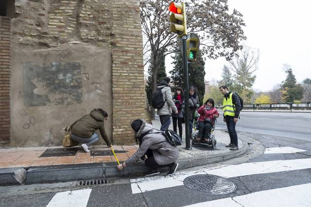

+++
weight = 10
+++

## Past

Some procedures, accomplishments and failures between 2016 and 2018

---

{}



## Data Gathering

<!-- ---



## Mapping parties*

* 5 Mapping parties
* Volunteers doing specific Fieldwork

<small>* Organized by [Mapeado Colaborativo](https://mapcolabora.org)</small>

First Mapping party in Las Armas (2016-07-05)
 -->

---



## Mapping parties*

* 5 Mapping parties
* Volunteers doing specific Fieldwork

<small>* Organized by [Mapeado Colaborativo](https://mapcolabora.org)</small>

<ul class="gallery" data-iterations="1" data-interval="3" data-mode="full-screen">
  <li></li>
  <li></li>
  <li></li>
  <li></li>
  <li></li>
</ul>

---



## Service Learning Activities

* Compulsory activity for students from Urban Studies at USJ's School of Architecture and Technology.
  - Addressed to future urban planners
  - Compulsory subject, Assessed activity
- Social implications of urban design
- Technological tools (GIS, queryng databases...)

Conchita Galve, from Discapacitados Sin Fronteras, shares her experience on moving by Zaragoza in a wheelchair.

{}
2/5 Mapping parties were also part of Service Learning Activities for students from Urban Studies at USJ's School of Architecture and Technology.
{}

---



## Fieldwork by our staff

<small>Thanks **César Canalís** (2016-17), **Lourdes Pérez** (2016-17) and **Javier Claver** (2018-2019)!</small>

Students from USJ taking field notes about kerbs and tactile paving in a pedestrian crossing. Credits: Héctor Ochoa

{}

---
{}



## Awareness rasising

Laura Moya (mundo Crip) and her guide dog, Geniva, explaining how blind people move and orient themselves in the city.

---



Arrabal Mapping party, organized by Mapeado Colaborativo with Ganchillo Social: Pedestrians are usually shocked by a group like this and asks us many questions and comments. It raises unplanned and interesting conversations.

{}

---

{}



## Visualization

2 online maps: for **visually impaired** people and for **mobility disabilities**.

---



{}

---

{}



##  Public attention

(Unexpected outcome)

Mapping Party recording for a live TV shop.

---



Newspaper news about a Mapping party (Heraldo, 2017)

{}

<!-- ---


## Publications

  
Cámara-Menoyo, C., Ruiz Varona, A., y León Casero, J. (2018). Zaragoza Accesible: un caso práctico de integración de SIG con fines sociales en el currículo educativo del grado de arquitectura. En <i>JIDA 5. Textos de Arquitectura, Docencia e Innovación</i> (pp. 280-295). Recolectores Urbanos.

  
  
Cámara-Menoyo, C., Ruiz-Varona, A., y León-Casero, J. (2017). Integrando SIG con fines sociales en el currículum educativo: el caso de Zaragoza Accesible. <i>Jornadas sobre Innovación Docente en Arquitectura</i>, (5), 56-66. <a href="https://doi.org/10.5821/jida.2017.5202">https://doi.org/10.5821/jida.2017.5202</a>

  
  
Orte Sierra, I., Sevilla-Callejo, M. (director) (2018). <i>Movilidad urbana e Información Geográfica Voluntaria: Accesibilidad en Las Fuentes.</i> Universidad de Zaragoza, Zaragoza. Recuperado a partir de <a href="https://zaguan.unizar.es/record/76655">https://zaguan.unizar.es/record/76655</a>

  
  
Ruiz, A., Temes-Córdovez, R. R., y Cámara-Menoyo, C. (2018). Accesibilidad y tecnologías de información colaborativas. Cartografías para una ciudad inclusiva. <i>Bitácora Urbano Territorial</i>, <i>28</i>(1), 155-162. <a href="https://doi.org/10.15446/bitacora.v28n1.68316">https://doi.org/10.15446/bitacora.v28n1.68316</a>

  

 -->

---
{}

## Limitations

---

## No routing calculations!

Paradoxically, we failed to (fully) achieve our first goal*.

*Current ongoing research, led by Miguel Sevilla.

{}

Miguel Sevilla there can provide you with further details.

{}

---

## About the visualization

* Maps are not useful
  - Not clear/easy to understand
  - Not visible by their audience
  - Manually updated -> outdated

---

## About OSM

* Sidewalks do not always conform a good network
* Difficult to add information if you are not used to it (technical skills)
* Lack of total control -> Uncertainty (about data)
* Some keys/values are limited
* Difficulties in tracing/crediting the work

---

## Overwhelming success

Could not attend to everyone who has shown interest on the project:

* Schools
* Public Administration
* Neighbourhood associations
* Activists

{}
