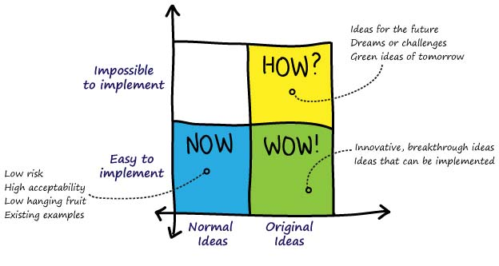

+++
title = "Accessible Zaragoza"
description = ""
outputs = ["Reveal"]

[reveal_hugo]
# theme = "white"
custom_theme = "usj.scss"
custom_theme_compile = true
plugins = ["plugin/gallery/gallery.plugin.js"]

# custom_theme = "css/usj.css"
# custom_theme_compile = false

# [logo]
# src = "/img/usj/logo-usj-negro.png"
# alt = "Universidad San Jorge Logo"

[reveal_hugo.templates.bg-dark]
class = "bg-dark"
background = "#000"
data-background-opacity = "0.3"

[reveal_hugo.templates.bibliographical-ref]
class = "bibliographical-ref"

[reveal_hugo.templates.bg-caption]
class = "bg-caption"

+++



## International Accessibility Workshop

Day 2: Working sessions

{}
You found the speaker notes!
{}

---

## Goals:

1. Getting to know each other
2. Identify possible conjoint actions
3. (Hopefully!) Outline a possible list of next actions

{} Nothing more (but nothing less!) {}

---

## Contents

0. Presentation (?) (10')
1. Particular goals (20')
2. Brainstorming (60')
3. Break (30')
4. Priorizing (60')
5. Strategy (40')

---

## Presentation?

Did you miss something about you or your project that you want to share with us?

---

## Particular goals

1. Think about your top-3 goals and note them in a post-it (5')
2. Paste up to 3 post-its on the wall with your project's goals
2. Share your thoughts with the team (15')

---



## Brainstorming (60')

---

1. Create 4 groups of similar size
2. Share ideas of projects that you would like to do conjointly (10')
3. Discuss them with the group and pick the ones you like the most. Write them on a post-it (10')
4. Swap groups (one person stays and keeps the post-its, the others move to other groups)
5. Share with the new team members a brief summary (5')
5. Repeat the process (20')



---



## Priorizing ideas (60')

1. Discuss where should we put each post-it in this matrix, according to difficulty and impact. (30')



1. One person per group picks the post-its and places into the matrix
2. Create two groups (optionally)



---

2. Identify which ideas are to be done immediately, someday or never
3. Identify if there is one or more ideas that can be done at short-medium term.



---



## Strategy (40')

1. Think about a possible course of action / next steps to achieve the top idea/project.
2. If more than one idea/project has been chosen, we can split into groups



---



## Thank you!
