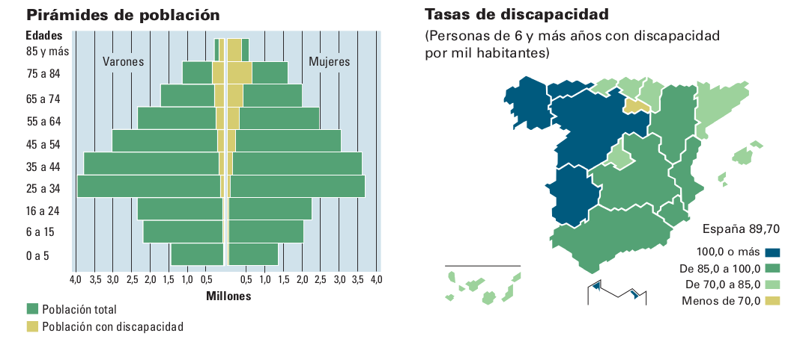

+++
title = "Usando OpenStreetMap con fines inclusivos: el caso de Zaragoza Accesible"
description = "Zaragoza Accesible es un proyecto de investigación-acción que consiste en mapear colectivamente aspectos relacionados con la accesibilidad urbana y discapacidad. En esta charla explicaré por qué decidimos usar OpenStreetMap así como nuestra metodología de toma de datos."
outputs = ["Reveal"]

[reveal_hugo]
# theme = "white"
custom_theme = "summerlab.scss"
custom_theme_compile = true
plugins = ["plugin/gallery/gallery.plugin.js"]

# custom_theme = "css/usj.css"
# custom_theme_compile = false

# [logo]
# src = "/img/usj/logo-usj-negro.png"
# alt = "Universidad San Jorge Logo"

[reveal_hugo.templates.bg-dark]
class = "bg-dark"
background = "#000"
data-background-opacity = "0.3"

[reveal_hugo.templates.bibliographical-ref]
class = "bibliographical-ref"

[reveal_hugo.templates.bg-caption]
class = "bg-caption"

[reveal_hugo.templates.portadas]
background-image = "img/trama.png"
background-size = "17px"
background-position = "top"
background-repeat = "repeat"
class = "portada"

+++



<small>SummerLab: Datos, participación y transparencia. 
26 de Junio de 2019. Tabakalera. Donostia.</small>

<h2>OpenStreetMap para fines inclusivos</h2>
<h3>El caso de Zaragoza Accesible</h3>

 
Carlos Cámara Menoyo

<small>Universidad San Jorge, Mapeado Colaborativo 
<a href="https://carloscamara.es">carloscamara.es</a> | <a href="https://twitter.com/carlescamara">@carlescamara</a></small>

{}
You found the speaker notes!
{}

---

<!--  -->



## Carlos Cámara Menoyo

**Profesor, investigador, aprendiz**

PDI en la [Universidad San Jorge](https://usj.es). Cofundador de [Mapeado Colaborativo](https://mapcolabora.org)

Entre mis múltiples intereses de investigación se encuentran las **comodificaciones entre ciudad, tecnología y sociedad** dentro del marco del informacionalismo y la cultura libre.

https://carloscamara.es | <i class="fab fa-twitter"></i>[@carlescamara](https://twitter.com/carlescamara)

---





## Sobre Zaragoza Accesible

Un mapa de barreras para una ciudad sin ellas.

(Parte I)

---

Algunos datos sobre discapacidad en España 

<small>Fuente: INE. (2009). *Encuesta de Discapacidad, Autonomía personal y situaciones de Dependencia. 2008.* Recuperado a partir de https://www.ine.es/revistas/cifraine/1009.pdf</small>



Según un informe de 2013 se estimaba que el 10% de la población de España tenía algún tipo de discapacidad.

Ahí no están contadas las personas de edad avanzada o las que de forma temporal tienen sus capacidades motrices mermadas (accidentes, carritos de bebé o carritos de la compra)

Todas estas personas están excluidas.



---



## Nuestro objetivo

Mejorar la autonomía de las personas con diversidad funcional y problemas de movilidad.

* Mapa
  - Evaluar/medir Zaragoza a nivel de accesibilidad
  - Visibilizar problemas de un colectivo excluido
  - Proporcionar rutas
- Testear un protocolo/metodología

---



### ¡No existen mapas para personas con discapacidad!

(A decir verdad no hay datos oficiales sobre el número de personas con discapacidad en España)



Se debe a que la mayoría de mapas que trabajamos son comerciales (hechos por empresas) y no ven allí un modelo de negocio claro.

Desgraciadamente tampoco existe cartografía oficial al respecto debido a los costos que supone hacerlo y mantenerlo.



---



<h3>¿Por qué no hay datos sobre accesibilidad urbana?</h2>

<ul>
<li>Porque es caro tomar datos y mantenerlos actualizados</li>
Porque es complejo
<li>Porque no hay un modelo de negocio claro</li>
<li>Porque no responden a un patrón de "normalidad"</li>
<li>...</li>
</ul>



Sé lo que os estáis preguntando: <b>¿Por qué no hay datos sobre accesibilidad urbana?</b>



---



### ...y sin embargo...

## ¡sería tremendamente útil si existiesen datos así!

* Aumentarían considerablemente la autonomía de muchas personas.
* Evidenciarían problemas de las ciudades actuales.
  - Podrían cambiar políticas y modelos de ciudades

---



### ¡Todos podemos hacer mapas!

---



## VGI: *Crowdsorcing* aplicado a los mapas

De la web 2.0 al VGI:

* Aplicaciones colaborativas
* FLOSS
* Abaratamiento de la tecnología
  - Tecnologías de posicionamiento Global (GPS, Galileo...)
* Licencias libres
* OpenData


