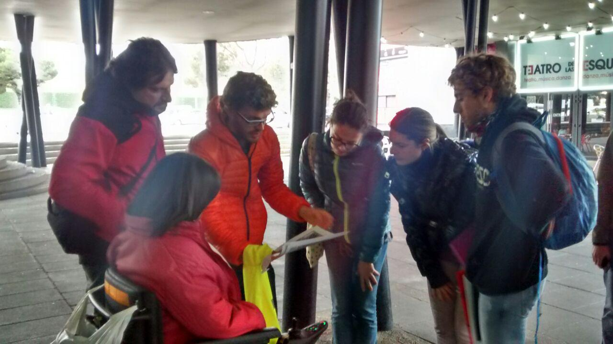
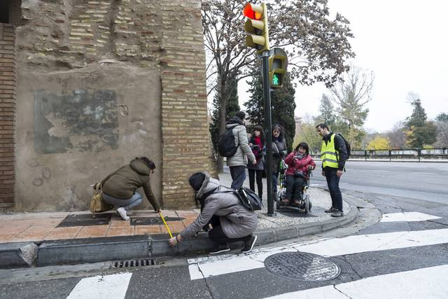

+++
weight = 20
+++



## Zaragoza Accesible

¿Cómo funciona Zaragoza Accesible a nivel de datos?

---





## Tipo de datos

¿Qué datos recopilamos?

---





---



## Mecanismos de toma de datos

¿Cómo recopilamos los datos?

3 Mecanismos de toma de datos.

---



## Mapping parties*

* 5 Mapping parties
* Volunteers doing specific Fieldwork

<small>* Organized by [Mapeado Colaborativo](https://mapcolabora.org)</small>

<ul class="gallery" data-iterations="1" data-interval="3" data-mode="full-screen">
  <li></li>
  <li></li>
  <li></li>
  <li></li>
  <li></li>
</ul>

---



## Service Learning Activities

* Compulsory activity for students from Urban Studies at USJ's School of Architecture and Technology.
  - Addressed to future urban planners
  - Compulsory subject, Assessed activity
- Social implications of urban design
- Technological tools (GIS, queryng databases...)

Conchita Galve, from Discapacitados Sin Fronteras, shares her experience on moving by Zaragoza in a wheelchair.

{}
2/5 Mapping parties were also part of Service Learning Activities for students from Urban Studies at USJ's School of Architecture and Technology.
{}

---



## Fieldwork by our staff

<small>Thanks **César Canalís** (2016-17), **Lourdes Pérez** (2016-17) and **Javier Claver** (2018-2019)!</small>

Students from USJ taking field notes about kerbs and tactile paving in a pedestrian crossing. Credits: Héctor Ochoa

{}

---

{}

## Herramientas de toma de datos

---

Fieldpapers

{}

---

## Resultados conseguidos

---
{}



## Awareness rasising

Laura Moya (mundo Crip) and her guide dog, Geniva, explaining how blind people move and orient themselves in the city.

---



Arrabal Mapping party, organized by Mapeado Colaborativo with Ganchillo Social: Pedestrians are usually shocked by a group like this and asks us many questions and comments. It raises unplanned and interesting conversations.



---





## Visualization

2 online maps: for **visually impaired** people and for **mobility disabilities**.

---



---



## Mapa base personalizado

Protanopia and Deuteranopia

{}

* Combination red-yellow-green soft-blue allows them an adequate and understandable visualization.
* Font that improves readibility for the users with visual disability.  -> typeface designed by American Printing House for the Blind, inc.

{}



---





##  Public attention

(Unexpected outcome)

Mapping Party recording for a live TV shop.

---



Newspaper news about a Mapping party (Heraldo, 2017)

---

Video de en ruta con la ciencia. Ponerlo de fondo en iframe.


