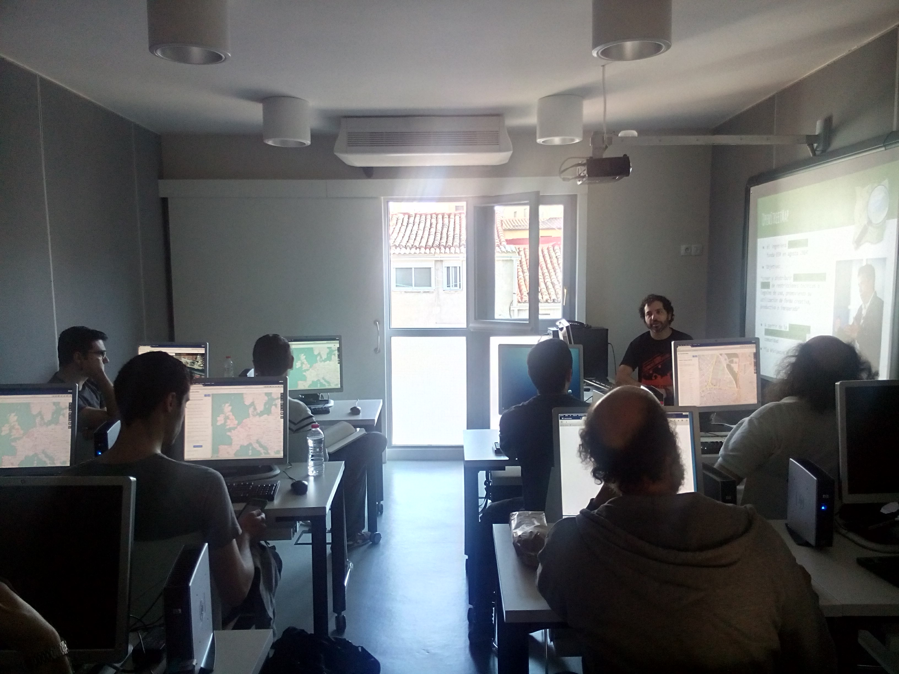

+++
weight = 20
+++



## Zaragoza Accesible

¿Cómo funciona Zaragoza Accesible a nivel de datos?

---

{}



## Tipo de datos

¿Qué datos recopilamos?

---



{}

---

{}



## Mecanismos de toma de datos

¿Cómo recopilamos los datos?


3 Mecanismos de toma de datos.


---



## Mapping parties*

* 5 Mapping parties
* Voluntarios que hacen trabajo de campo de forma coordinada

<small>* Organizadas por [Mapeado Colaborativo](https://mapcolabora.org)</small>

<ul class="gallery" data-iterations="1" data-interval="3" data-mode="full-screen">
  <li></li>
  <li></li>
  <li></li>
  <!-- <li></li> -->
  <li></li>
</ul>

---



## Actividades de aprendizaje y servicio

* Actividad obligatoria para alumnos de Urbanismo del grado de Arquitectura de la Universidad San Jorge
  - Dirigida hacia futuros planificadores urbanos
  - Asignatura obligatoria, práctica evaluable
- Implicaciones sociales del diseño urbano
- Herramientas digitales (GIS, consultas a bases de datos...)

Conchita Galve, de Discapacitados Sin Fronteras, comparte su experiencia sobre desplazarse en silla de ruedas por Zaragoza.

{}
2/5 Mapping parties were also part of Service Learning Activities for students from Urban Studies at USJ's School of Architecture and Technology.
{}

---



## Trabajo de campo de investigadores

<small>¡Gracias **César Canalís** (2016-17), **Lourdes Pérez** (2016-17) y **Javier Claver** (2018-2019)!</small>

Estudiantes de la USJ tomando datos de campo sobre bordillos y pavimento táctil. Foto: Héctor Ochoa

{}

---

{}



## Herramientas de toma de datos

---



http://fieldpapers.org/

---



Tabla de toma de datos

---



<a href="https://github.com/westnordost/StreetComplete">Streetcomplete</a> (App para Android)

---



[Mapillary](https://mapillary.com) (imágenes a pie de calle colaborativas)

{}

---



## Publicación de datos

<small>Subimos los datos de campo a OSM añadiendo etiquetas consensuadas por la comunidad.</small>

Sesión de Mapeado Colaborativo para la subida de datos a OSM.

---

## Resultados conseguidos

---
{}



## Concienciación

Laura Moya (mundo Crip) y su perra guía, Geniva, explicando cómo las personas ciegas se mueven y orientan en la ciudad.

---



Mapping party en Arrabal, organizada por Mapeado Colaborativo y Ganchillo Social: un grupo como este llama la atención y siempre hay algún peatón que nos pregunta cosas o se interesa por el trabajo.

{}

---

{}



## Visualización

2 mapas online: para **discapacidad visual** y **discapacidad motriz**.

---



---



## Mapa base personalizado

Protanopia y Deuteranopia

{}

* Combination red-yellow-green soft-blue allows them an adequate and understandable visualization.
* Font that improves readibility for the users with visual disability.  -> typeface designed by American Printing House for the Blind, inc.

{}

{}

---

{}



##  Atención de los medios

(resultado inesperado)

Grabación en directo de una Mapping Party. Foto: Carlos Cámara.

---



Aparición en periódico (Heraldo, 2017)

---



Aparición en <a href="http://alacarta.aragontelevision.es/programas/en-ruta-con-la-ciencia/">En Ruta con la Ciencia nº 84</a> (Aragón TV)

{}
