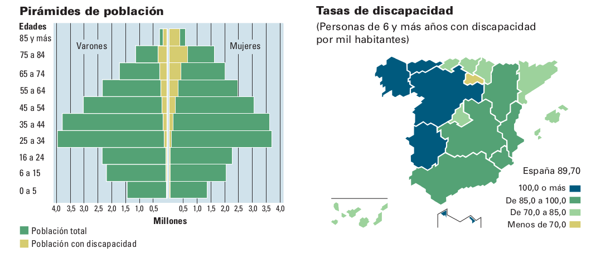

+++
weight = 10
+++



## ¿Cómo lo hacemos?

* Talleres y encuentros quincenales
* Charlas (ver [listado completo](https://mapcolabora.org/talk))
* Proyectos

Miguel Sevilla, en el encuentro Eurocities.

---

## Proyectos

Inicialmente, impulsados por nosotros. Ahora queremos alterar

---



### Manual OpenStreetMap

Manual colaborativo de introducción a OSM. Forma parte de nuestro proceso de documentación del trabajo.

[Ver online](https://mapcolabora.gitbooks.io/manual-osm/content/)

---





### Ziclabilidad

Mapa dinámico de la infraestructura ciclable en Zaragoza:

* carriles bici y vías ciclables: tipo, tipo de pavimento, estado del firme...
* estaciones de alquiler de bicicleta pública (BiZi): nombre y dirección, foto, número de anclajes libres
* aparcabici
* tiendas o entidades relacionados con bicicletas

---



Mapa interactivo <a href="http://umap.openstreetmap.fr/es/map/ziclabilidad_141722#12/41.6520/-0.8916">ver mapa original</a>



---





### Mapatón Humanitario

Hay zonas en el mundo que no han sido cartografiadas todavía. Normalmente no es lo único que les falta.

Colaboramos con [Médicos Sin Fronteras](https://www.msf.es/mapaton-la-cartografia-herramienta-humanitaria) para tener información de las zonas donde trabajan


* Mapatón: ncuentro entre muchas personas que se unen para cartografiar una zona o un tema.
* Humanitario: porque
* zonas: zonas remotas en las que intervienen los equipos de MSF en Malí, Nigeria, República Democrática del Congo (RDC) y áreas damnificadas por el ciclón Idai en Mozambique



---

<ul class="gallery" data-iterations="0" data-interval="2.5" data-mode="full-screen">
  <li></li>
  <li></li>
  <li></li>
  <li></li>

</ul>

---

cartografiado zonas remotas en las que intervienen los equipos de MSF en Malí, Nigeria, República Democrática del Congo (RDC) y áreas damnificadas por el ciclón Idai en Mozambique



---





## Sobre Zaragoza Accesible

Un mapa de barreras para una ciudad sin ellas.

(Parte I)

---

Algunos datos sobre discapacidad en España 

<small>Fuente: INE. (2009). *Encuesta de Discapacidad, Autonomía personal y situaciones de Dependencia. 2008.* Recuperado a partir de https://www.ine.es/revistas/cifraine/1009.pdf</small>



Según un informe de 2013 se estimaba que el 10% de la población de España tenía algún tipo de discapacidad.

Ahí no están contadas las personas de edad avanzada o las que de forma temporal tienen sus capacidades motrices mermadas (accidentes, carritos de bebé o carritos de la compra)

Todas estas personas están excluidas.



---



## Nuestro objetivo

Mejorar la autonomía de las personas con diversidad funcional y problemas de movilidad.

* Mapa
  - Evaluar/medir Zaragoza a nivel de accesibilidad
  - Visibilizar problemas de un colectivo excluido
  - Proporcionar rutas
- Testear un protocolo/metodología

---



### ¡No existen mapas para personas con discapacidad!

(A decir verdad no hay datos oficiales sobre el número de personas con discapacidad en España)



Se debe a que la mayoría de mapas que trabajamos son comerciales (hechos por empresas) y no ven allí un modelo de negocio claro.

Desgraciadamente tampoco existe cartografía oficial al respecto debido a los costos que supone hacerlo y mantenerlo.



---



<h3>¿Por qué no hay datos sobre accesibilidad urbana?</h2>

<ul>
<li>Porque es caro tomar datos y mantenerlos actualizados</li>
<li>Porque es complejo</li>
<li>Porque no hay un modelo de negocio claro</li>
<li>Porque no responden a un patrón de "normalidad"</li>
<li>...</li>
</ul>



Cuesta de entender, ¿verdad?
Sé lo que os estáis preguntando: <b>¿Por qué no hay datos sobre accesibilidad urbana?</b>



---



### ...y sin embargo...

## ¡sería tremendamente útil si existiesen datos así!

* Aumentarían considerablemente la autonomía de muchas personas.
* Evidenciarían problemas de las ciudades actuales.
  - Podrían cambiar políticas y modelos de ciudades

---



### ¡Todos podemos hacer mapas!

---



## VGI: *Crowdsorcing* aplicado a los mapas

De la web 2.0 al VGI:

* Aplicaciones colaborativas
* FLOSS
* Abaratamiento de la tecnología
  - Tecnologías de posicionamiento Global (GPS, Galileo...)
* Licencias libres
* OpenData


