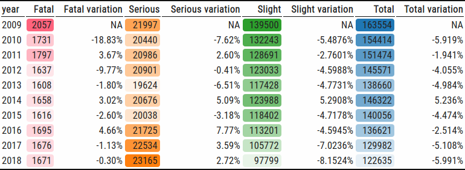
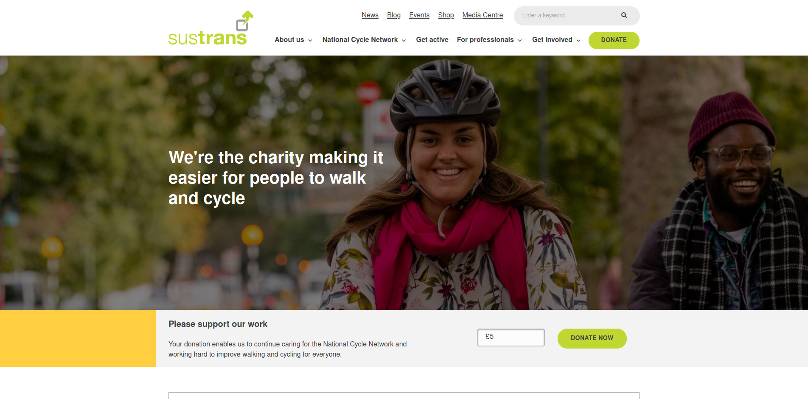
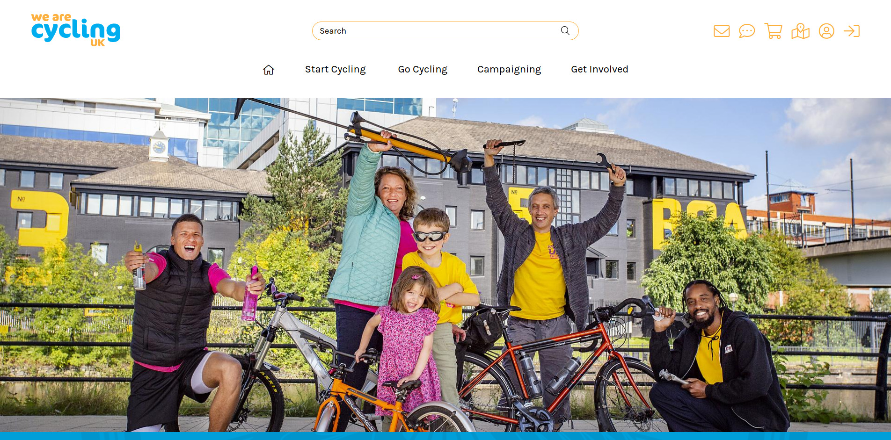
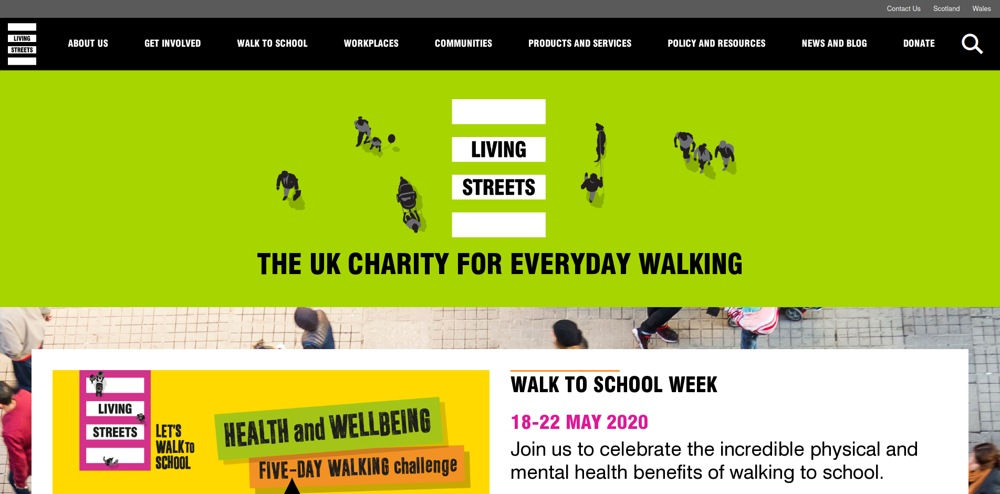
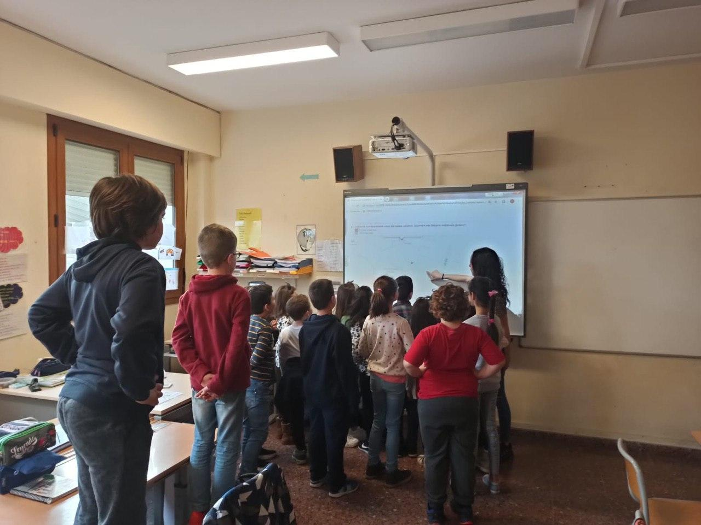

+++
title = "Oxford Brookes"
description = "Sample lecture for post interview."
outputs = ["Reveal"]

[reveal_hugo]
# theme = "white"
custom_theme = "obu.scss"
custom_theme_compile = true
plugins = ["plugin/gallery/gallery.plugin.js"]

[logo]
src = "img/obu-logo.png"
alt = "Oxford Brookes University Logo"

[reveal_hugo.templates.bg-dark]
class = "bg-dark"
background = "#000"
data-background-opacity = "0.3"

[reveal_hugo.templates.pink]
class = "pink"
background = "#d10373"
data-background-opacity = "0.3"

[reveal_hugo.templates.bibliographical-ref]
class = "bibliographical-ref"

[reveal_hugo.templates.bg-caption]
class = "bg-caption"

[reveal_hugo.templates.portadas]
class = "portada"

+++

<!--  -->



<small>Demo for a job position interview</small>

<h2>PEST Research Assistant</h2>

<small>30th September 2020</small>

Carlos Cámara Menoyo

<small><a href="https://carloscamara.es/en">https://carloscamara.es/en</a> | <a href="https://twitter.com/drccamara">@drccamara</a></small>

{}
After an excellent background on the need for studying the relationship/impacts between COVID and active travel, I was asked to do a brief introduction demonstrating how could I 

Disclaimer:

* I am new to UK, so I am not 
* Sorry if my proposals are too basic/obvious or too bold: I have only worked on this presentation for an evening, and I've seen you have been working on this topic (or related ones) for years.

{}

---

## PEST's Goals

Increase understanding of place-based policy and activity in relation to active travel in the aftermath of the Covid-19 pandemic

{} <small> Assess how they support equitable and sustainable transport for most vulnerable colectives/areas </small> {}

{} <small> 
Assess Active Travel's role in the transition to climate neutrality and healthier and more equitable ecosystems
 </small> {}

{}
 by investigating the response of English local planning and highway authorities to the UK government’s Emergency Active Travel Fund (EATF) and Cycling and Walking strategy.
{}

---



## Indicators

<ul>
<li class="fragment" data-fragment-index="1">Types:</li>
<ul class="fragment" data-fragment-index="1">
<li>Quantitative (open data repositories, datasets...)</li>
<li>Qualitative (interviews, study cases)</li>
</ul>
<li class="fragment" data-fragment-index="2">Scale:</li>
<ul class="fragment" data-fragment-index="2">
<li>Macro (Country/County)</li>
<li>Local (city)</li>
<li>Micro (cases -eg. George Street)</li>
</ul>
</ul>

---



Indicators' matrix (a draft proposal)

| Scale                   | Analysis units       | Indicator                                                                            | Sources                                                                                                                       |
| ----------------------- | -------------------- | ------------------------------------------------------------------------------------ | ----------------------------------------------------------------------------------------------------------------------------- |
| Macro (Country, county) | Legislation          | Number of laws, regulations, measures...                                             | Open Data, Interviews, Desk Research                                                                                          |
|                         |                      | Budget                                                                               |                                                                                                                               |
|                         |                      | Location                                                                             |                                                                                                                               |
|                         | Sales/users          | Number of vehicles/sales per type                                                    |                                                                                                                               |
| Local (City)            | Active travel habits | Routes by type of transport, demographics and time (month, weekday, hours), avg km.. | Strava Metro <small>(free, starting 27/09/2020, [blog post](https://blog.strava.com/the-new-human-powered-era-20951))</small> |
|                         | Highways’ network    | Number of Km by type (pedestrian, bike lanes...)                                     | OpenStreetMap, Open Data Repos                                                                                                |
| Micro (Cases)           | Study case           | Geography (Location)                                                                 | Interviews, Case Study                                                                                                        |
|                         |                      | Stakeholders (Promoter, beneficiaries...)                                            |                                                                                                                               |
|                         |                      | Description                                                                          |                                                                                                                               |
|                         |                      | Impacts (Number of Km...)                                                            |                                                                                                                               |

{}
With those indicators, we can create indicators' matrices like the proposed one
{}

---

{}



## Dashboards / Apps

---



### Maps (1)

---



### Maps (2)

---

### Tables

{}

---



## Data Gathering

---

{}

### Stakeholders & Experts

{}

I assume this will be the main source of information and is one of the strenghts of the project.

I admit that since I am new to UK, I didn't know any of the stakeholders you've mentioned  (Sustrans, Cycling UK and Living Streets) other than an initial exploration to their websites

{}

---

<ul class="gallery" data-iterations="1" data-interval="2.5" data-mode="full-screen">
  <li></li>
  <li></li>
  <li></li>
  <li></li>
  <li></li>

</ul>

{}

{}

{}

---



### Interviews

* Experience in:
  * PhD (key agents in urban commons)
  * MSc (key agents in drupal community)
* Types:
  * Structured/semi-structured
* Tasks:
  * Outline Design 
  * Recording
  * Transcription

---



### Datasets

1. Automated downloads <small>(Open Data repositories, stakeholders, Strava Metro...)</small>
   1. Querying APIs
   2. Web scrapping
2. Data munging
   1. Data cleaning
   2. Data calculation
   3. ...
3. Data visualization

---



### Fieldwork

---



## Project's structure

---



---

### Datasets

* Rows: observations
* Columns: attributes
  * `id`: unique -> join with other datasets
* Open formats (preferred): compatibility

---

### Control version

* Track files' history
* Sharing with others
* Backup! 😱

---



## Results' Dissemination

---



### Dashboards

1. [COVID-19 Dashboard](https://ccamara.github.io/covid_spain/)
2. Walk to school

---



### Websites

1. My personal website (https://carloscamara.es/en)
2. Guest blog posts ([Medium](https://towardsdatascience.com/considerations-on-the-importance-of-data-and-science-in-data-science-b19f5155fd9c))

---



### (Interactive) reports

1. [STATS19 data exploration](https://ccamara.github.io/stats19_exploration/)

---



### Podcasts

1. Technician:
   1. Scalae (Recording, audio editing, publishing)
2. Guest:
   1. [Arquicafe Stepien y Barno](https://www.youtube.com/watch?time_continue=1252&v=MTtfXY67Xgs&feature=emb_title)
   2. [COVID and participation](#)

<!-- ---



### Media (newspapers, TV) -->

---



### Media (newspapers, TV)

---



### Talks

---



### Papers  🎓
  
* [ORCID profile](http://orcid.org/0000-0002-9378-0549)
* [Research Gate](https://www.researchgate.net/profile/Carlos_Camara_Menoyo)
* [Google Scholar](https://scholar.google.es/citations?user=zuCP2PAAAAAJ&hl=ca)

---



## Thank you!

{}Questions? / Comments? {}