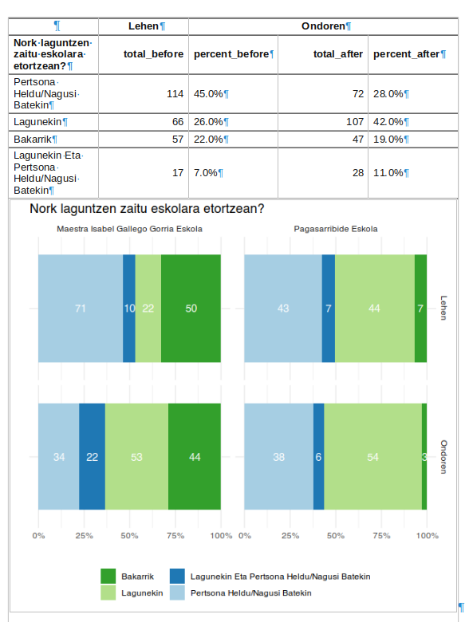
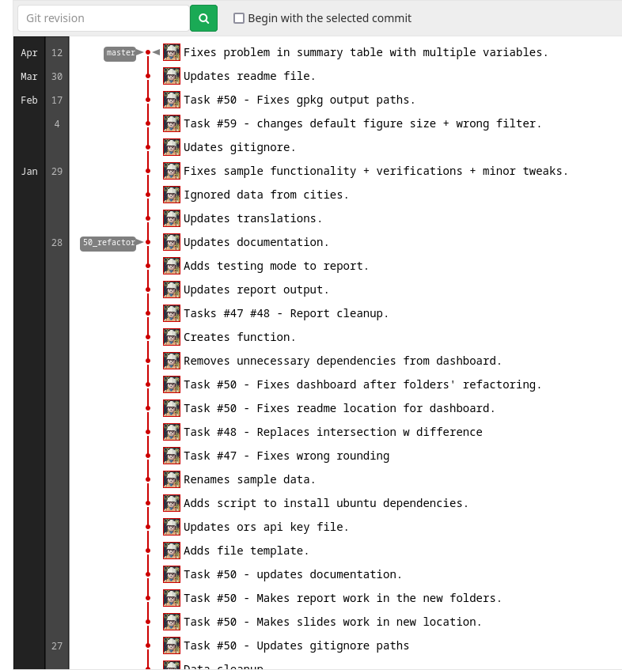
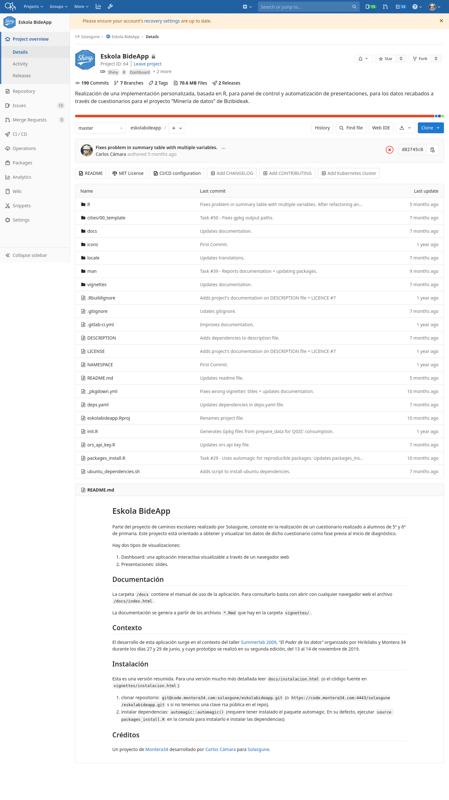
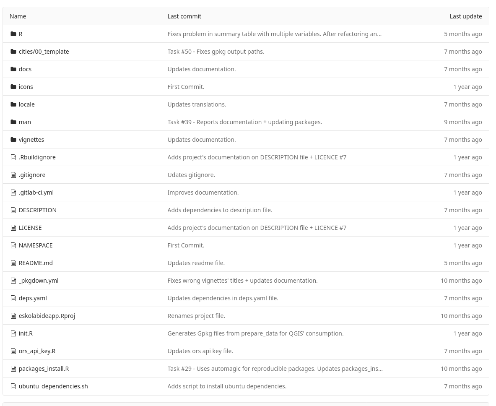
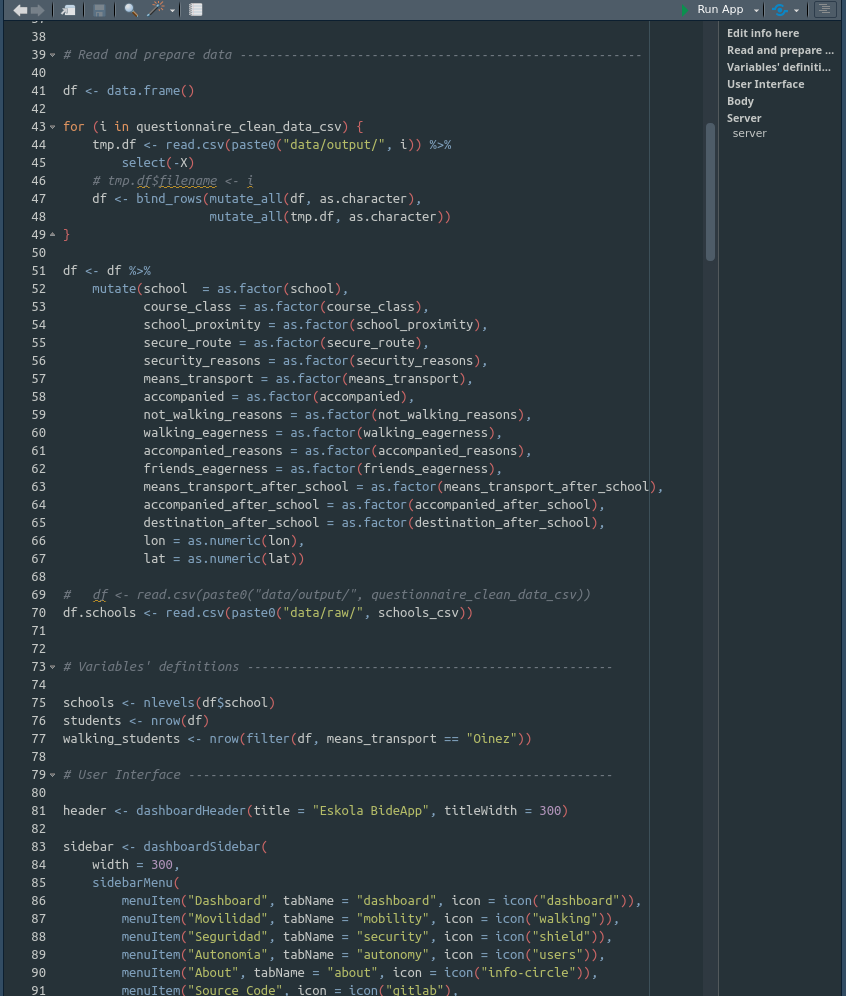
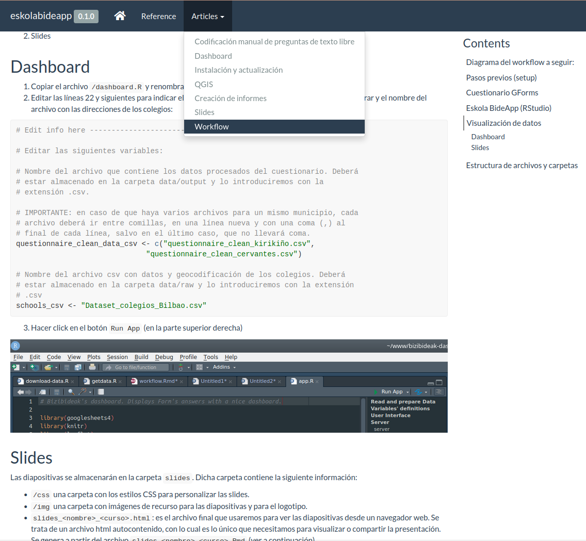
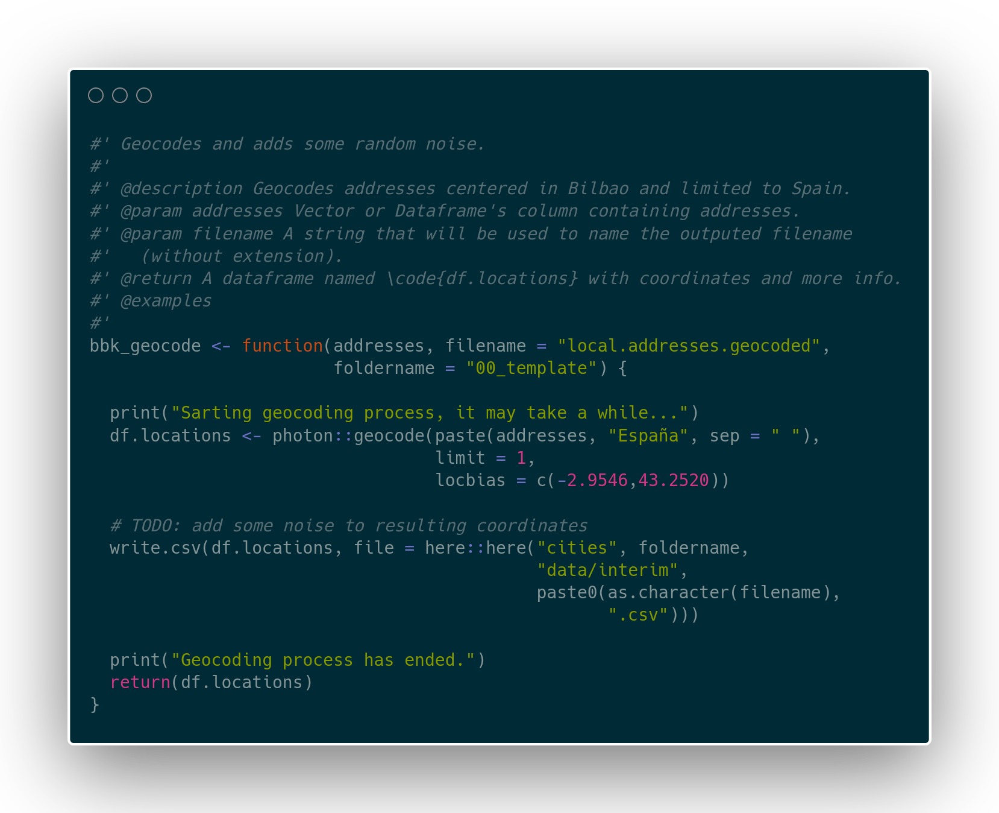
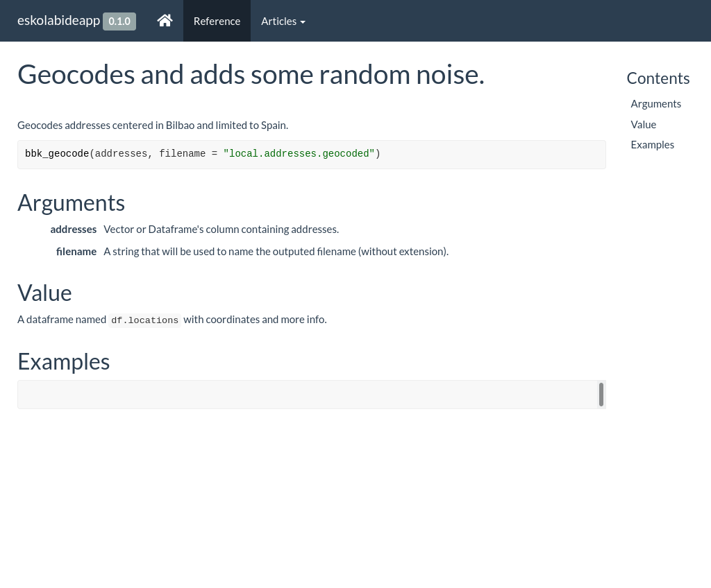
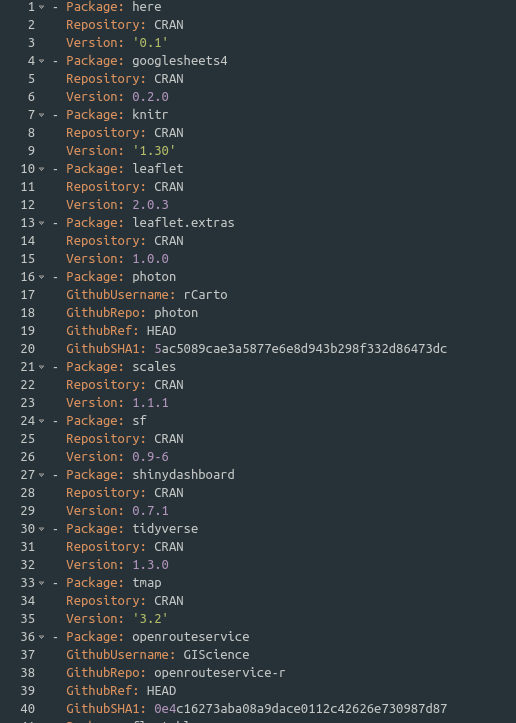

+++
weight = 20
+++



Learn by example:

## Eskola Bideapp

Designing and assessing routes to increase children's autonomy, health and welbeing while going to school

{}

Now that we know what research tools are, why are they so important and how can they look like

We are going to focus on a study case and get some lessons from it.

Eskolabideapp 

{}

---

{}

## What problems does it solve?

---



<ul>
  <li><b>Communication</b>: Generates easy to understand visualisations for children, policy-makers and researchers</li>
  <ul>
    <li>Promotes discussion/learning</li>
    <li>Promotes data-literacy at school</li>
  </ul>
</ul>

  

  
An interactive dashboard (Shinny App) showing questionnaire's responses

---



<ul>
  <li><b>Impacts' Assessment</b>: Researchers wanted to assess behaviour changes after their work with children.</li>
</ul>

  

---

* **Replicability:** the same study was to be performed in several schools in different cities. 
  * From several days to a matter of minutes.
  * Now it can be applied to any city and any school in the world.

{}

---

## What it does

{}

Creates visualisations and reports used to design and assess walk to school routes in order for children to walk on their own to their schools.

<!-- https://mermaid-js.github.io/mermaid-live-editor/edit/#eyJjb2RlIjoiZmxvd2NoYXJ0IExSXG5BW0Rvd25sb2FkIHF1ZXN0aW9ubmFpcmUncyBhbnN3ZXJzXSAtLT4gRE1cblxuc3ViZ3JhcGggRE1bRGF0YSBtYW5pcHVsYXRpb25dXG5kaXJlY3Rpb24gVEJcbkJbUmVuYW1lIHZhcmlhYmxlc10gLS0-IENbSW50ZWdyaXR5IGNoZWNrXVxuQyAtLT4gRFtGb3JtYXR0aW5nXVxuRCAtLT4gRVtHZW9jb2RlXVxuZW5kXG5ETSAtLT4gREVcblxuc3ViZ3JhcGggREVbRGF0YSBFeHBvcnRdXG4gICAgZGlyZWN0aW9uIFRCXG4gICAgICAgIEV4cG9ydCAtLT4gQ1NWXG4gICAgICAgIEV4cG9ydCAtLT4gR1BLR1xuZW5kXG5cbkRFICAtLT4gREFcblxuc3ViZ3JhcGggREFbRGF0YSBBbmFseXNpc11cbmRpcmVjdGlvbiBUQlxuQW5hbHlzaXMgLS0-IEZbU3VtbWFyeSBzdGF0aXN0aWNzXVxuQW5hbHlzaXMgLS0-IEdbRGlzdGFuY2UgbWF0cmljZXNdXG5lbmRcblxuXG5EQSAtLT4gRFZcblxuc3ViZ3JhcGggRFZbRGF0YSBWaXN1YWxpc2F0aW9uXVxuZGlyZWN0aW9uIFRCXG5cblxuVHlwZXMgLS0-IE1hcHNcblR5cGVzIC0tPiBCYXJwbG90c1xuVHlwZXMgLS0-IFRhYmxlc1xuXG5cblxuXG5NZWRpdW0gLS0-IFNsaWRlc1xuTWVkaXVtIC0tPiBEYXNoYm9hcmRcbk1lZGl1bSAtLT4gUmVwb3J0c1tSZXBvcnRzIE1TIFdvcmRdXG5cbmVuZCIsIm1lcm1haWQiOiJ7XG4gIFwidGhlbWVcIjogXCJuZXV0cmFsXCJcbn0iLCJ1cGRhdGVFZGl0b3IiOmZhbHNlLCJhdXRvU3luYyI6dHJ1ZSwidXBkYXRlRGlhZ3JhbSI6ZmFsc2V9 -->

{}

---

<!--  -->


## The process: ~~a fantasy tale~~ an overview*

<small>*For teaching purpose only: actually, it is never so linear. 
Also, each topic could be developed in one or more sessions.</small>

{}

Now that we know what the tool does and why does it do it...

I'm going to give an overview of the creation process to introduce you with the topics we'll be covering in future sessions.

Of course, reality is more complex than this and it is seldom so linear.

{}

---



## Define requirements

You have a clear understanding of what the tool has to do.

* Replicability
* Multilingual: Spanish + Euskara
* It should be manipulated by peple who are not very IT proficient (no programming knowledge)
* Should be understandable for children and policy makers

{}

You have a clear understanding of what the tool has to do.

* Either because you know your research well or defining it with colleagues.

In this example we've seen how important it was to make it replicable, but there were other requirements, too.

{}

---

{}



## Use a VCS*

<a href="https://git-scm.com/">Git</a> tracks changes in every file within the project over time.

<ul>
  <li>You can see what, when, who has changed</li>
  <li>You can go back in time</li>
  <li>You can save your work without affecting stability (branches, PR)</li>
</ul>

  

<small>* Version Control System</small>

---



### Bonus:Use an external repository 
(github, gitlab...)

<ul>
  <li>You always have multiple backup copies</li>
  <li>Enhances discoverability and collaboration</li>
  <li>Extra features: CI, issues...</li>
</ul>

  

{}

---



## Be organised

<small>Use a clear, known files/folders structure (probably using a template/boilerplate).</small>

At least the following content

<ul>
  <li><code>Readme</code> file</li>
  <li>folder to store <b>functions</b></li>
  <li>folder to store all <b>data</b></li>
  <li>folder to store all <b>documentation</b></li>
</ul>

  
  
EskolabideApp's file structure. We'll be covering the main files and folders in future sessions.

{}

Folder and files' structure is important to find information and for others to collaborate.

This is the structure of the tool. In future session we'll be covering what each file and folder does, but at least your tool should have the following content.

{}

---



## Start Coding

Some things to take into account when coding

<ul>
  <li>Divide & conquer: pick a feature and develop one at a time</li>
  <li>Avoid repetition vs re-usability:</li>
  <ul>
    <li>control flow (conditionals, loops...)</li>
    <li>functions/objects</li>
  </ul>
  <li>Start now, improve later</li>
  <ul>
    <li>Files organisation</li>
    <li>Function</li>
  </ul>
</ul>

  

{}

This image shows some code from the tool using R.

R is the language programming that we will be using in this course and it is specially useful for researchers for many reasons.

Some things to take into account when coding

{}

---

{}



## Document everyhing

<small>Do it for the others and for your future self!</small>

Write exhaustive documents about:
  <ul>
  <li>important/confusing parts of the process (installation, workflow, contributing guides)</li>
  <li>functions</li>
  </ul>
 

</pre>

  

  
Documentation website for eskolabideapp package

---



### Integrated documentation

<small>Comment every function...</small>

</pre>

  
  <small>...to generate a nice website with documentation (with <code>pkgdown</code>)</small>

{}

---

## Make sure it always work

<small>Today, in your computure, and tomorrow in other people's computer.</small>

* Manage dependencies
  * `automagic`
  * `renv`
* Automated testing
* Reproduce environment
  * `docker`

---

## Repeat, repeat

