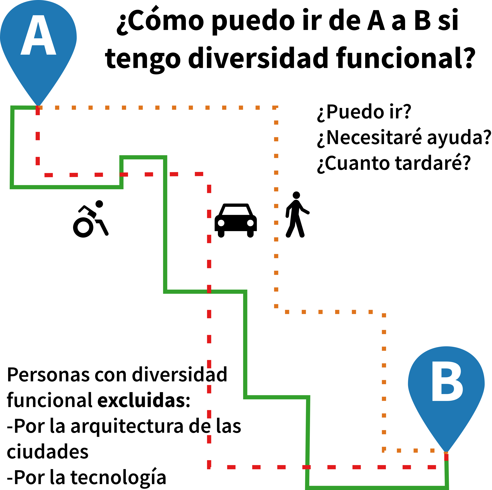

+++
title = "Accessible Zaragoza"
description = ""
outputs = ["Reveal"]

[reveal_hugo]
# theme = "white"
# custom_theme = "custom-theme.scss"
# custom_theme_compile = true

custom_theme = "css/usj.css"
custom_theme_compile = false

[reveal_hugo.templates.bg-dark]
class = "bg-dark"
background = "#000"
data-background-opacity = "0.3"

+++

<!--  -->
<!--  -->


## Accessible Zaragoza study case

### Collaborative mapping for the integration of impaired people.

<small>Carlos Cámara | Javier Corzán | Javier Claver </small>

{}
You found the speaker notes!
{}

---

{}

## Background (2016)

* We had finished Social Map Risk (2013-2015)
* Sponsorship by Bantierra and Fundación Adecco (from 2010 to 2016) aimed to promote action research projects regarding disabilities.
  - Focused at building level

---

1. Extending the research to **urban scale**
  1. From buildings to cities
2. Link the project with prior research on (social) **exclusion and urban morphology**
  1. Right to the city (Lefebvre, 168; Harvey 2008)
  2. Spatial Justice (Soja, 2010)

{}

---

## The problem(s)

People with disabilities cannot lead a complete life because of two types of exclusion.




---

## Our Goal

* Create a pilot, capable of:
  - Assessing Zaragoza in terms of accessibility
  - Providing routing calculations for disabled people in order to improve their authonomy
- Test a protocol/methodology
